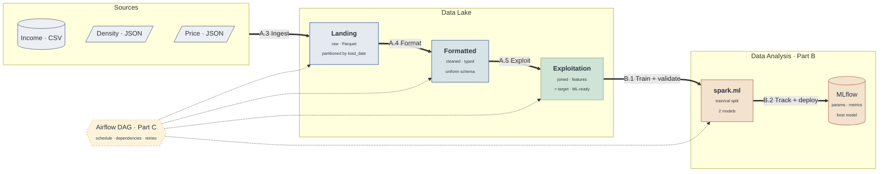

# Lab 3: Report

PDF document (max four A4 pages), including the following:

- **A.1:** Explain the selected datasets and the analysis you chose to perform together with the necessary justification.
- **A.2:** Draw/sketch the pipeline(s) at a higher abstraction level (i.e., you can group a couple of related Spark operations into one single box). Use the notation that you find more appropriate.
- **B.3:** Discuss the results obtained in the Model Training and Validation.
- **Assumptions/Justifications:** Elaborate on any assumption not stated in the lab statement but that you followed. This can be done for each one of the pipelines and should refer to any specificity of your solution that should help to understand the decisions you made in your code. You can refer to the tasks (using their section names, e.g., A.2, A.3 ...) inside the document.

---

## A.1 Datasets and Analysis

We predict the housing price tier of a Barcelona neighbourhood in a given year. The target has three classes, low, mid, and high, defined as the per-year terciles of the average sale price per square metre. The unit of analysis is the neighbourhood-year, identified by the official neighbourhood code (Codi_Barri) and the year.

We integrate three Open Data BCN datasets, all at the neighbourhood-year grain:

| Dataset | Format | Coverage | Provides | Role |
|---|---|---|---|---|
| Family disposable income (RFD) | CSV, 11 files | 2007-2017 | income index, Barcelona = 100 | feature |
| Population and density | JSON | 2010-2021 | population, gross and net density (inh/ha), surface | feature |
| Housing sale price | JSON | 2013-2017 | sale price per m² | target source |

All three carry Codi_Barri and a year, so they join exactly and need no name reconciliation. Their common period is 2013 to 2017. An inner join on neighbourhood and year over this window yields 359 rows with no missing values in the retained columns. The features are the income index, population, gross density, net density, surface, and a per-year rank of the income index. The price columns define the label, so we remove them from the features to avoid leakage.

We predict the price tier rather than an income or density tier for two reasons. With income as the label, the density data alone already separates the classes well and the price data adds no value, so the third dataset would not be justified. With density as the label, the anti-leakage rule forces us to drop population and surface as well, since the density measures are built from them, which leaves almost no usable features. Predicting the price tier keeps both income and density as informative, non-leaking predictors. Cutting the tiers per year removes the city-wide price increase across 2013 to 2017, so the label reflects a neighbourhood's standing relative to the city in that year. The resulting classes are balanced, with 119, 120, and 120 members.

We also reviewed the unemployment, incidence, and real-estate listing datasets and did not use them. The unemployment and incidence files are truncated samples, returning about one hundred records per year and, for unemployment, a single month, with the 2015 unemployment file empty, which leaves too little signal at the neighbourhood-year grain. The listing dataset covers only 2020 and 2021, so it does not overlap the income and price series.

## A.2 Architecture

## B.3 Results

## Assumptions / Justifications
